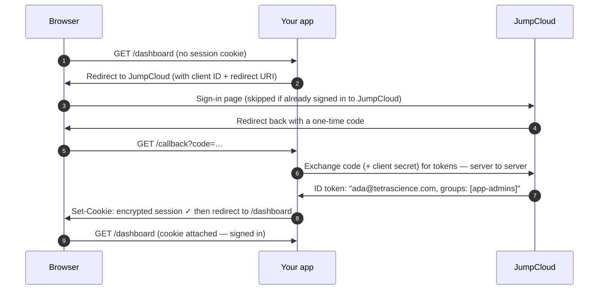

# jumpcloud-sso

Plug-and-play JumpCloud single sign-on for TetraScience internal apps.

One npm package, `@tetrascience-npm/jumpcloud-sso`, with three entry points:

| Import                                    | For                                                |
| ----------------------------------------- | -------------------------------------------------- |
| `@tetrascience-npm/jumpcloud-sso/next`    | Next.js App Router apps (Auth.js / next-auth v5)   |
| `@tetrascience-npm/jumpcloud-sso/express` | Express-served React SPAs (express-openid-connect) |
| `@tetrascience-npm/jumpcloud-sso/core`    | Framework-agnostic helpers used by both            |

This README assumes you have **never touched SSO or OIDC before**. Read the
first two sections once and the rest of your life gets easier.

- [What is SSO and why do we do this?](#what-is-sso-and-why-do-we-do-this)
- [What is OIDC in one minute](#what-is-oidc-in-one-minute)
- [The login flow, drawn out](#the-login-flow-drawn-out)
- [Register your app in JumpCloud (checklist)](#register-your-app-in-jumpcloud-checklist)
- [Quickstart: Next.js in 5 steps](#quickstart-nextjs-in-5-steps)
- [Quickstart: Express in 5 steps](#quickstart-express-in-5-steps)
- [Gotchas](#gotchas)
- [FAQ](#faq)
- [Workspace layout (for contributors)](#workspace-layout-for-contributors)

---

## What is SSO and why do we do this?

Every internal tool we build needs to answer the same two questions: _who is
this person?_ and _are they allowed to do this?_ Without single sign-on, every
app would answer them its own way — its own user table, its own passwords, its
own "forgot password" flow, its own bugs. Multiply that by every internal tool
we run and you get dozens of password databases nobody wants to be responsible
for, and dozens of accounts to disable every time someone leaves the company.

Single sign-on (SSO) means we outsource "who is this person?" to **one**
system that already knows: JumpCloud, our identity provider. You sign in to
JumpCloud once, and every internal app trusts JumpCloud's answer instead of
keeping its own list of users and passwords. Apps never see your password —
they only receive proof, from JumpCloud, of who you are.

Think of a music festival. At the gate you show your ID once, and the staff
puts a wristband on you. For the rest of the day, every stage, bar, and
backstage door just glances at the wristband — nobody asks for your ID again.
JumpCloud is the gate. The signed token it hands to each app is the wristband.
And some wristbands have extra tags on them — "backstage crew" — which is
exactly what JumpCloud **groups** are: extra tags apps can use to decide who
gets into the admin area.

Concretely: when you open an internal app, it notices you don't have a session
yet and bounces your browser to JumpCloud. If you're already signed in to
JumpCloud (you usually are), you bounce straight back — often so fast you don't
see it — carrying a cryptographically signed token that says "this is
ada@tetrascience.com, and she's in these groups." The app checks the signature,
sets its own session cookie, and from then on you're just… logged in. One
password, managed in one place, revoked in one place when someone offboards.

## What is OIDC in one minute

OIDC (OpenID Connect) is the protocol apps and JumpCloud speak to make the
bounce work. You'll see five words constantly; here is what they mean:

| Word                          | Meaning                                                                                                                                                                                                  |
| ----------------------------- | -------------------------------------------------------------------------------------------------------------------------------------------------------------------------------------------------------- |
| **Issuer**                    | JumpCloud's address: `https://oauth.id.jumpcloud.com/`. Where your app sends people to sign in, and whose signature it trusts. (Keep the trailing slash — see [Gotchas](#gotchas).)                      |
| **Client ID / client secret** | Your app's own username and password _with JumpCloud_. They identify the app, not the user. The secret is shown once when the app is registered — treat it like any production secret.                   |
| **Redirect URI**              | The exact URL in your app where JumpCloud sends the user back after sign-in. JumpCloud refuses to redirect anywhere that isn't on its allowlist — that's what stops attackers from receiving your login. |
| **ID token**                  | The wristband: a signed JSON document (a JWT) from JumpCloud stating who the user is — email, name, and any claims we asked for. Your app verifies the signature instead of trusting the browser.        |
| **Groups claim**              | The field inside the ID token that lists the user's JumpCloud groups (ours is named `memberOf`). This is what route gating ("only `app-admins` may open `/admin`") is built on.                          |

## The login flow, drawn out



The browser only ever carries a one-time code and a session cookie. The tokens
themselves travel server-to-server and stay on the server.

## Register your app in JumpCloud (checklist)

Do this once per app (JumpCloud Admin Console → **SSO Applications** → **Add
New Application** → **Custom Application**):

- [ ] Choose **Configure SSO with OIDC** (a "Custom OIDC App").
- [ ] Grant types: **Authorization Code** and **Refresh Token**.
- [ ] Client authentication type: **Client Secret Post** (this library is
      configured to match).
- [ ] Redirect URI — the **exact** URL for your stack, one per environment:
  - Next.js: `https://your-app.example.com/api/auth/callback/jumpcloud`
    (local dev: `http://localhost:3000/api/auth/callback/jumpcloud`)
  - Express: `https://your-app.example.com/callback`
    (local dev: `http://localhost:3000/callback`)
- [ ] Login URL: your app's base URL.
- [ ] Attribute scopes: check **Email** and **Profile**.
- [ ] Group attributes: enable **include group attribute**, and name it
      **`memberOf`** (the library's default groups claim).
- [ ] **Bind user groups to the app** — users not in a bound group can't even
      start the login. Bind the groups you'll gate routes with (e.g.
      `app-admins`) plus whatever group represents "everyone who may use this
      app".
- [ ] Click activate, then **copy the client ID and client secret
      immediately** — JumpCloud shows the secret exactly once. Store it in the
      team's secret manager, never in git.

## Quickstart: Next.js in 5 steps

Prereqs: Next.js 14+ (App Router), and the package installed from our JFrog
registry:

```bash
# .npmrc in your app repo (once):
#   @tetrascience-npm:registry=https://tetrascience.jfrog.io/artifactory/api/npm/npm-local/
npm install @tetrascience-npm/jumpcloud-sso next-auth@beta
```

**Step 1 — environment.** Create `.env.local` (never commit it):

```bash
AUTH_SECRET=            # npx auth secret   (or: openssl rand -base64 32)
AUTH_TRUST_HOST=true    # needed when not on Vercel
JUMPCLOUD_CLIENT_ID=    # from the JumpCloud app you registered
JUMPCLOUD_CLIENT_SECRET=
```

**Step 2 — create `auth.ts`** at the project root:

```ts
import { createJumpCloudAuth } from '@tetrascience-npm/jumpcloud-sso/next';
import { resolveEnv } from '@tetrascience-npm/jumpcloud-sso/core';

export const { handlers, auth, signIn, signOut, routeGroups } =
  createJumpCloudAuth({
    ...resolveEnv(), // reads the JUMPCLOUD_* env vars
    routeGroups: {
      '/admin': ['app-admins'], // JumpCloud group NAMES
    },
  });
```

**Step 3 — mount the Auth.js routes.** Create
`app/api/auth/[...nextauth]/route.ts`:

```ts
import { handlers } from '../../../../auth';

export const { GET, POST } = handlers;
```

**Step 4 — protect routes.** Create `middleware.ts` at the project root:

```ts
import { createAuthMiddleware } from '@tetrascience-npm/jumpcloud-sso/next';
import { auth, routeGroups } from './auth';

export default createAuthMiddleware(auth, {
  publicPaths: ['/'], // '/' = just the home page
  routeGroups,
});

export const config = {
  matcher: ['/((?!_next/static|_next/image|favicon.ico).*)'],
};
```

**Step 5 — use the session in server code** (middleware is a convenience, not
a security boundary — always re-check where the data lives):

```tsx
// app/dashboard/page.tsx
import { redirect } from 'next/navigation';
import { auth } from '../../auth';

export default async function DashboardPage() {
  const session = await auth();
  if (!session?.user) redirect('/api/auth/signin?callbackUrl=/dashboard');
  return (
    <p>
      Hi {session.user.email} — groups: {session.user.groups?.join(', ')}
    </p>
  );
}
```

Redirect URI to register in JumpCloud:
`http://localhost:3000/api/auth/callback/jumpcloud` (and the production
equivalent). A runnable version of all of this lives in
[apps/example-next](apps/example-next).

## Quickstart: Express in 5 steps

Prereqs: Express 4 or 5, and:

```bash
# .npmrc in your app repo (once):
#   @tetrascience-npm:registry=https://tetrascience.jfrog.io/artifactory/api/npm/npm-local/
npm install @tetrascience-npm/jumpcloud-sso express-openid-connect
```

**Step 1 — environment.** Create `.env` (never commit it):

```bash
BASE_URL=http://localhost:3000   # where THIS app runs
SESSION_SECRET=                  # openssl rand -hex 32 (cookie secret, NOT the client secret)
JUMPCLOUD_CLIENT_ID=
JUMPCLOUD_CLIENT_SECRET=
```

**Step 2 — create the SSO toolkit:**

```ts
import { createJumpCloudSSO } from '@tetrascience-npm/jumpcloud-sso/express';
import { resolveEnv } from '@tetrascience-npm/jumpcloud-sso/core';

const sso = createJumpCloudSSO({
  ...resolveEnv(),
  baseUrl: process.env.BASE_URL ?? 'http://localhost:3000',
  sessionSecret: process.env.SESSION_SECRET ?? '',
});
```

**Step 3 — mount the session middleware** (adds `req.oidc` plus `/login`,
`/logout`, and `/callback` routes; nothing is protected yet):

```ts
import express from 'express';

const app = express();
app.use(sso.authMiddleware);
app.use(express.static('public')); // your SPA
```

**Step 4 — add the BFF identity endpoint and protected APIs:**

```ts
app.get('/api/me', sso.meHandler); // { user, groups } or 401 — the SPA calls this on load

app.get('/api/data', sso.requireAuth, (req, res) => {
  res.json({ hello: req.oidc.user?.email });
});

app.get('/api/admin', sso.requireGroup(['app-admins']), (_req, res) => {
  res.json({ admin: true });
});
```

**Step 5 — call it from your React page.** No tokens in the browser — just
`fetch`:

```js
const res = await fetch('/api/me');
if (res.status === 401) location.href = '/login';
const { user, groups } = await res.json();
```

Redirect URI to register in JumpCloud: `http://localhost:3000/callback` (and
the production equivalent). A runnable version lives in
[apps/example-express](apps/example-express).

## Gotchas

**The issuer needs its trailing slash.** JumpCloud's issuer is
`https://oauth.id.jumpcloud.com/` — with the slash. OIDC discovery appends
`.well-known/openid-configuration` to it and validates that the document's
issuer matches _exactly_. Drop the slash and discovery fails with a confusing
issuer-mismatch error. The library's default has the slash; if you override
`JUMPCLOUD_ISSUER`, keep it.

**One group is a string, two groups are an array.** JumpCloud emits the
`memberOf` claim as a bare string when the user is in exactly one bound group,
and as an array when in two or more. Code that assumes an array works in
testing and breaks in production. Everything in this library already runs the
claim through `normalizeGroups()` from `/core` — use it too if you ever read
the claim yourself.

**Route gating uses group NAMES, not IDs.** `routeGroups: { '/admin':
['app-admins'] }` matches the literal string JumpCloud puts in the claim. If
someone renames the group in JumpCloud, gating silently breaks (nobody gets
in — or worse, a recreated group with the old name gets everyone in). Treat
group renames as breaking changes and coordinate them.

**Vercel preview deployments have unpredictable URLs.** JumpCloud only
redirects to allowlisted URIs, and `my-app-git-branch-abc123.vercel.app`
changes per branch — you can't register them all. Either (a) log in only via a
canonical domain (register the production/staging URL and test SSO there), or
(b) use Auth.js's redirect-proxy support: set `AUTH_REDIRECT_PROXY_URL` to a
stable deployment's `/api/auth` URL and register _that_ single callback in
JumpCloud; previews then relay through it (the library passes any extra
Auth.js config through `authConfig`, e.g. `redirectProxyUrl`).

**Middleware is a convenience, not a security boundary.** The Next.js
middleware gives fast redirects and nice 401/403s, but it runs in front of the
route — misconfigure the matcher (or hit a future framework bug) and a request
can reach your code without passing through it. Every server component, route
handler, and server action that touches sensitive data must re-check
`await auth()` (and the group, via `hasAnyGroup`) itself. The example app
demonstrates this on every protected page.

## FAQ

**Why don't we store tokens in the browser?**
Because the browser is where XSS happens. If any script injected into your
page could read a token from `localStorage`, it could impersonate the user
from anywhere, for as long as the token lives. In the BFF
(backend-for-frontend) pattern this library uses, tokens live server-side and
the browser holds only an encrypted, `httpOnly` session cookie that scripts
cannot read. The SPA asks its own backend "who am I?" (`/api/me`) and the
backend answers from the session.

**How do I protect just one route?**
Express: put the guard on exactly that route —
`app.get('/api/data', sso.requireAuth, handler)` — and nothing else changes.
Next.js: list everything else in `publicPaths`, or skip the middleware
entirely and re-check in that one page/handler:
`const session = await auth(); if (!session?.user) redirect('/api/auth/signin')`.

**How do I gate a route by team?**
Put the team's JumpCloud group on the route. Next.js:
`routeGroups: { '/billing': ['finance'] }` (and re-check with
`hasAnyGroup(session.user.groups ?? [], ['finance'])` in the page). Express:
`app.get('/api/billing', sso.requireGroup(['finance']), handler)`. Remember to
**bind** that group to the JumpCloud app, or its members can't log in at all.

**Why does logout send me to JumpCloud?**
Because your app's session is only half the story — the wristband analogy
again: leaving one stage doesn't take the wristband off. The Express
integration sets `idpLogout: true`, so `/logout` clears the app session _and_
ends the JumpCloud session; otherwise the next visit would silently sign you
straight back in, which reads as "logout didn't work". (On shared machines,
that silent re-login is a real problem — hence ending both.)

**Login fails with "user is not assigned to this application" (or similar).**
The user isn't in any user group bound to the JumpCloud app. Binding groups is
step one of access control — `routeGroups` only refines it per-route.

## Workspace layout (for contributors)

```
packages/core           Framework-agnostic: config defaults, normalizeGroups,
                        hasAnyGroup, resolveEnv
packages/next           createJumpCloudAuth + createAuthMiddleware (Auth.js v5)
packages/express        createJumpCloudSSO (express-openid-connect)
packages/jumpcloud-sso  The ONE published package — composes the three builds
                        into dist/{core,next,express} with subpath exports
apps/example-next       Runnable Next.js 15 example (never published)
apps/example-express    Runnable Express BFF example (never published)
```

The three libraries are buildable Nx projects; `packages/jumpcloud-sso` is the
only released artifact. Its build copies each library's `dist/` into place;
cross-entry imports use the package's own subpaths
(`@tetrascience-npm/jumpcloud-sso/core`), which Node resolves via package
self-reference at runtime.

Common commands (see [CONTRIBUTING.md](CONTRIBUTING.md) for the full story):

```bash
npm ci                      # install
npx nx run-many -t lint,test,build
npx nx dev example-next     # run an example against a real JumpCloud app
npx nx dev example-express
```

Releases are fully automated from conventional commits on `main` — see
[CONTRIBUTING.md](CONTRIBUTING.md).
