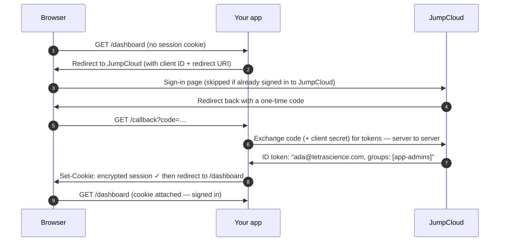

# jumpcloud-sso

Plug-and-play JumpCloud single sign-on for TetraScience internal apps.

One npm package, `@tetrascience-npm/jumpcloud-sso`, with three entry points:

| Import                                    | For                                                |
| ----------------------------------------- | -------------------------------------------------- |
| `@tetrascience-npm/jumpcloud-sso/next`    | Next.js App Router apps (Auth.js / next-auth v5)   |
| `@tetrascience-npm/jumpcloud-sso/express` | Express-served React SPAs (express-openid-connect) |
| `@tetrascience-npm/jumpcloud-sso/core`    | Framework-agnostic helpers used by both            |

This README assumes you have **never touched SSO or OIDC before**. Read the
first two sections once and the rest of your life gets easier.

- [jumpcloud-sso](#jumpcloud-sso)
  - [What is SSO and why do we do this?](#what-is-sso-and-why-do-we-do-this)
  - [What is OIDC in one minute](#what-is-oidc-in-one-minute)
  - [The login flow, drawn out](#the-login-flow-drawn-out)
  - [Register your app in JumpCloud (checklist)](#register-your-app-in-jumpcloud-checklist)
  - [Fastest start: the setup CLI](#fastest-start-the-setup-cli)
  - [Quickstart: Next.js in 5 steps](#quickstart-nextjs-in-5-steps)
  - [Quickstart: Express in 5 steps](#quickstart-express-in-5-steps)
  - [Gotchas](#gotchas)
  - [FAQ](#faq)
  - [Workspace layout (for contributors)](#workspace-layout-for-contributors)

---

## What is SSO and why do we do this?

Every internal tool we build needs to answer the same two questions: _who is
this person?_ and _are they allowed to do this?_ Without single sign-on, every
app would answer them its own way — its own user table, its own passwords, its
own "forgot password" flow, its own bugs. Multiply that by every internal tool
we run and you get dozens of password databases nobody wants to be responsible
for, and dozens of accounts to disable every time someone leaves the company.

Single sign-on (SSO) means we outsource "who is this person?" to **one**
system that already knows: JumpCloud, our identity provider. You sign in to
JumpCloud once, and every internal app trusts JumpCloud's answer instead of
keeping its own list of users and passwords. Apps never see your password —
they only receive proof, from JumpCloud, of who you are.

Think of a music festival. At the gate you show your ID once, and the staff
puts a wristband on you. For the rest of the day, every stage, bar, and
backstage door just glances at the wristband — nobody asks for your ID again.
JumpCloud is the gate. The signed token it hands to each app is the wristband.
And some wristbands have extra tags on them — "backstage crew" — which is
exactly what JumpCloud **groups** are: extra tags apps can use to decide who
gets into the admin area.

Concretely: when you open an internal app, it notices you don't have a session
yet and bounces your browser to JumpCloud. If you're already signed in to
JumpCloud (you usually are), you bounce straight back — often so fast you don't
see it — carrying a cryptographically signed token that says "this is
ada@tetrascience.com, and she's in these groups." The app checks the signature,
sets its own session cookie, and from then on you're just… logged in. One
password, managed in one place, revoked in one place when someone offboards.

## What is OIDC in one minute

OIDC (OpenID Connect) is the protocol apps and JumpCloud speak to make the
bounce work. You'll see five words constantly; here is what they mean:

| Word                          | Meaning                                                                                                                                                                                                                                                                                            |
| ----------------------------- | -------------------------------------------------------------------------------------------------------------------------------------------------------------------------------------------------------------------------------------------------------------------------------------------------- |
| **Issuer**                    | JumpCloud's address: `https://oauth.id.jumpcloud.com/`. Where your app sends people to sign in, and whose signature it trusts. (Keep the trailing slash — see [Gotchas](#gotchas).)                                                                                                                |
| **Client ID / client secret** | Your app's own username and password _with JumpCloud_. They identify the app, not the user. The secret is shown once when the app is registered — treat it like any production secret.                                                                                                             |
| **Redirect URI**              | The exact URL in your app where JumpCloud sends the user back after sign-in. JumpCloud refuses to redirect anywhere that isn't on its allowlist — that's what stops attackers from receiving your login.                                                                                           |
| **ID token**                  | The wristband: a signed JSON document (a JWT) from JumpCloud stating who the user is — email, name, and any claims we asked for. Your app verifies the signature instead of trusting the browser.                                                                                                  |
| **Groups claim**              | The field inside the ID token that lists the user's JumpCloud groups. Its name is whatever you typed into the JumpCloud app's group-attribute field — the library defaults to `groups`, which is what our apps use. This is what route gating ("only `app-admins` may open `/admin`") is built on. |

## The login flow, drawn out



The browser only ever carries a one-time code and a session cookie. The tokens
themselves travel server-to-server and stay on the server.

## Register your app in JumpCloud (checklist)

Do this once per app (JumpCloud Admin Console → **SSO Applications** → **Add
New Application** → **Custom Application**):

- [ ] Choose **Configure SSO with OIDC** (a "Custom OIDC App").
- [ ] Grant types: **Authorization Code** and **Refresh Token**.
- [ ] Client authentication type: **Client Secret Post** (this library is
      configured to match).
- [ ] Redirect URI — the **exact** URL for your stack, one per environment.
      The two stacks use different paths; copy them character for character:
  - Next.js: `https://your-app.example.com/api/auth/callback/jumpcloud`
    (local dev: `http://localhost:3000/api/auth/callback/jumpcloud`)
  - Express: `https://your-app.example.com/callback`
    (local dev: `http://localhost:3000/callback`)

  The trailing **`/jumpcloud`** on the Next.js path is not decoration: Auth.js
  appends the provider id to its callback route, so the endpoint only exists at
  `/api/auth/callback/jumpcloud`. Register a bare `/api/auth/callback` and
  every sign-in fails with JumpCloud's `invalid_request` — _"the
  `redirect_uri` parameter does not match any of the OAuth 2.0 Client's
  pre-registered redirect urls."_ Express, built on a different library,
  genuinely has no suffix.

  Register a URI per stack — JumpCloud accepts several on one application, and
  the same error appears when a stack's path is missing. If you cannot add
  one (or want both examples on one application), point Express at a path
  that _is_ registered with `callbackPath`:

  ```ts
  createSSORouter({
    ...resolveEnv(),
    baseUrl,
    sessionSecret,
    callbackPath: '/api/auth/callback/jumpcloud',
  });
  ```

- [ ] Login URL: your app's base URL.
- [ ] **Post-logout redirect URI** (optional but recommended) — where
      JumpCloud returns the browser after ending the session. Needed only if
      you pass `postLogoutRedirect`; JumpCloud rejects the whole logout request
      if the URI it receives is not registered, which looks like a broken
      logout. Leave the option unset and JumpCloud uses its own page instead.
- [ ] Attribute scopes: check **Email** and **Profile**.
- [ ] Group attributes: enable **include group attribute**, and note the name
      you give it. **`groups`** is the library's default, and what every app
      in our tenant uses, so it needs no further config; anything else — an
      older app on **`memberOf`**, say — must be passed as `groupsClaim` (or
      `JUMPCLOUD_GROUPS_CLAIM`), or every group-gated route 403s because the
      claim reads as absent.
- [ ] **Bind user groups to the app** — users not in a bound group can't even
      start the login. Bind the groups you'll gate routes with (e.g.
      `app-admins`) plus whatever group represents "everyone who may use this
      app".
- [ ] Click activate, then **copy the client ID and client secret
      immediately** — JumpCloud shows the secret exactly once. Store it in the
      team's secret manager, never in git.

## Fastest start: the setup CLI

The package ships a scaffolding CLI. From the root of your existing Next.js or
Express project (with the JFrog `.npmrc` in place):

```bash
npx @tetrascience-npm/jumpcloud-sso setup
```

It detects your framework from `package.json` (override with `--type next` or
`--type express`), writes the wiring files described in the quickstarts below,
merges the required variables into `.env.example`, and prints the remaining
manual steps (install command, secret generation, the JumpCloud redirect URI
to register). It never overwrites existing files unless you pass `--force`,
so re-running is safe. `--yes` skips the confirmation, `--dir` targets another
directory, `--help` shows everything.

The quickstarts below walk through the same files by hand — worth reading once
even if the CLI writes them for you.

## Quickstart: Next.js in 5 steps

Prereqs: **Next.js `>=14.2.25` or `>=15.2.3`** (App Router), and the package
installed from our JFrog registry:

```bash
# .npmrc in your app repo (once):
#   @tetrascience-npm:registry=https://tetrascience.jfrog.io/artifactory/api/npm/npm-local/
npm install @tetrascience-npm/jumpcloud-sso next-auth@^5.0.0-beta.32
```

> **The Next.js floor is a security floor, not a compatibility one.**
> CVE-2025-29927 (CVSS 9.1) lets any request skip middleware entirely by
> sending an `x-middleware-subrequest` header — which turns
> `createAuthMiddleware` into a no-op and walks an unauthenticated request
> straight onto your pages. Patched in **14.2.25**, **15.2.3**, **13.5.9**, and
> **12.3.5**. The `peerDependencies` range refuses anything older, so `npm
install` will tell you. If you are pinned to a vulnerable version for other
> reasons, block that header at your edge and treat middleware as decorative
> until you upgrade.

**Step 1 — environment.** Create `.env.local` (never commit it):

```bash
AUTH_SECRET=            # npx auth secret   (or: openssl rand -base64 32)
JUMPCLOUD_CLIENT_ID=    # from the JumpCloud app you registered
JUMPCLOUD_CLIENT_SECRET=
```

`AUTH_SECRET` must be **at least 32 characters** and not a placeholder — the
library refuses to start otherwise. It signs the session JWT that carries your
JumpCloud groups, so anyone who recovers it can mint a session for any user in
any group, and every guard here will honor it. It is not the JumpCloud client
secret.

Not on Vercel? Set `AUTH_URL=https://your-app.example.com` so Auth.js knows its
own origin. Reach for `AUTH_TRUST_HOST=true` only for local dev or behind a
proxy that **strips inbound `X-Forwarded-Host`** — otherwise an attacker can
set that header and steer your post-sign-in redirect to their own site.

**Step 2 — create `auth.ts`** at the project root:

```ts
import { createJumpCloudAuth } from '@tetrascience-npm/jumpcloud-sso/next';
import { resolveEnv } from '@tetrascience-npm/jumpcloud-sso/core';

export const {
  handlers,
  auth,
  signIn,
  signOut,
  signOutEverywhere,
  routeGroups,
} = createJumpCloudAuth({
  ...resolveEnv(), // reads the JUMPCLOUD_* env vars
  routeGroups: {
    '/admin': ['app-admins'], // JumpCloud group NAMES
  },
});
```

Call `resolveEnv()` directly — don't write `?? 'placeholder-client-id'`
fallbacks to keep CI green. `resolveEnv()` already warns instead of throwing
during `next build`, and a fallback survives into production, where it defers
the failure to your first real user's sign-in with an error that points at
JumpCloud rather than at the unset variable.

**Step 3 — mount the Auth.js routes.** Create
`app/api/auth/[...nextauth]/route.ts`:

```ts
import { handlers } from '../../../../auth';

export const { GET, POST } = handlers;
```

**Step 4 — protect routes.** Create `middleware.ts` at the project root:

```ts
import { createAuthMiddleware } from '@tetrascience-npm/jumpcloud-sso/next';
import { auth, routeGroups } from './auth';

export default createAuthMiddleware(auth, {
  publicPaths: ['/'], // '/' = just the home page
  routeGroups,
});

export const config = {
  matcher: ['/((?!_next/static|_next/image|favicon.ico).*)'],
};
```

**Step 5 — use the session in server code** (middleware is a convenience, not
a security boundary — always re-check where the data lives). Create
`session.ts` next to `auth.ts`:

```ts
import { createSessionTools } from '@tetrascience-npm/jumpcloud-sso/next';
import { auth } from './auth';

export const { requireSession, getSessionUser, SignedIn, SignedOut } =
  createSessionTools(auth);
```

then in any page, layout, or server action:

```tsx
// app/dashboard/page.tsx
import { requireSession } from '../../session';

export default async function DashboardPage() {
  // Redirects to sign-in when anonymous; add `groups: ['app-admins']` to
  // also enforce group membership (throws to the nearest error boundary).
  const session = await requireSession({ callbackUrl: '/dashboard' });
  return (
    <p>
      Hi {session.user?.email} — groups: {session.user?.groups?.join(', ')}
    </p>
  );
}
```

For conditional UI instead of a redirect, use the components:

```tsx
<SignedIn groups={['app-admins']} fallback={<p>Admins only.</p>}>
  <AdminPanel />
</SignedIn>
<SignedOut>
  <a href="/api/auth/signin">Sign in with JumpCloud</a>
</SignedOut>
```

(`getSessionUser()` is the non-redirecting variant: `{ user, groups }` or
`null`.)

**Step 6 — sign out of BOTH sessions.** Use `signOutEverywhere` as a server
action:

```tsx
import { signOutEverywhere } from '../auth';

<form action={signOutEverywhere}>
  <button type="submit">Sign out</button>
</form>;
```

Auth.js's own `signOut()` (and the `/api/auth/signout` page) deletes your app's
cookie and stops there. The JumpCloud session survives it, so the next "Sign
in" click sails through with no prompt and puts the user straight back in — on
a personal laptop a confusing no-op, on a shared machine a handover of the
previous user's account. `signOutEverywhere()` clears the local session first,
then redirects to JumpCloud's `end_session_endpoint` with `id_token_hint`.

To come back to your own app afterwards, pass `postLogoutRedirect` to
`createJumpCloudAuth` — and register that exact URL on the JumpCloud
application, or JumpCloud rejects the logout. Off-origin values throw rather
than being silently dropped, so this can't become an open redirect.

Redirect URI to register in JumpCloud:
`http://localhost:3000/api/auth/callback/jumpcloud` (and the production
equivalent). A runnable version of all of this lives in
[apps/example-next](apps/example-next).

## Quickstart: Express in 5 steps

Prereqs: Express 4 or 5, and:

```bash
# .npmrc in your app repo (once):
#   @tetrascience-npm:registry=https://tetrascience.jfrog.io/artifactory/api/npm/npm-local/
npm install @tetrascience-npm/jumpcloud-sso express-openid-connect
```

**Step 1 — environment.** Create `.env` (never commit it):

```bash
BASE_URL=http://localhost:3000   # where THIS app runs
SESSION_SECRET=                  # openssl rand -hex 32 (cookie secret, NOT the client secret)
JUMPCLOUD_CLIENT_ID=
JUMPCLOUD_CLIENT_SECRET=
```

`SESSION_SECRET` must be at least 32 characters — the session cookie holds your
ID, access, and refresh tokens _and_ answers every auth check, so a guessable
one is a full authorization bypass, not a hygiene nit.

In production `BASE_URL` must be **`https://`**. express-openid-connect refuses
to mark the session cookie `Secure` on a non-HTTPS origin, so a plain-HTTP
`BASE_URL` ships those tokens in cleartext; the library rejects it at startup.
For an app genuinely reachable only over a trusted internal network, opt out
explicitly with `allowInsecureBaseUrl: true`.

**Step 2 — create the SSO router:**

```ts
import { createSSORouter } from '@tetrascience-npm/jumpcloud-sso/express';
import { resolveEnv } from '@tetrascience-npm/jumpcloud-sso/core';

const sso = createSSORouter({
  ...resolveEnv(),
  baseUrl: process.env.BASE_URL ?? 'http://localhost:3000',
  sessionSecret: process.env.SESSION_SECRET ?? '',
});
```

**Step 3 — mount it, once, before your routes.** One `app.use` wires the
session middleware (`req.oidc`), the `/login`, `/logout`, and `/callback`
routes, and the `/api/me` BFF identity endpoint (`{ user, groups }` or 401 —
the SPA calls it on load). Nothing else is protected yet:

```ts
import express from 'express';

const app = express();
app.use(sso.router);
app.use(express.static('public')); // your SPA
```

(Prefer wiring the pieces yourself — separate session middleware, custom
`/api/me` path? `createJumpCloudSSO` returns them individually, and
`createSSORouter` also passes them through, including a `mePath` option.)

**Step 4 — guard your APIs:**

```ts
app.get('/api/data', sso.requireAuth, (req, res) => {
  res.json({ hello: req.oidc.user?.email });
});

app.get('/api/admin', sso.requireGroup(['app-admins']), (_req, res) => {
  res.json({ admin: true });
});
```

**Step 5 — call it from your React page.** No tokens in the browser — just
`fetch`:

```js
const res = await fetch('/api/me');
if (res.status === 401) location.href = '/login';
const { user, groups } = await res.json();
```

Redirect URI to register in JumpCloud: `http://localhost:3000/callback` (and
the production equivalent) — or pass `callbackPath` to match a URI that is
already registered, e.g. `callbackPath: '/api/auth/callback/jumpcloud'` to
share one application with an Auth.js app. A runnable
version lives in
[apps/example-express](apps/example-express).

## Gotchas

**The issuer needs its trailing slash.** JumpCloud's issuer is
`https://oauth.id.jumpcloud.com/` — with the slash. OIDC discovery appends
`.well-known/openid-configuration` to it and validates that the document's
issuer matches _exactly_. Drop the slash and discovery fails with a confusing
issuer-mismatch error. The library's default has the slash; if you override
`JUMPCLOUD_ISSUER`, keep it.

**The groups claim is named per app, and a mismatch is silent.** The library
defaults to `groups`, which is what our apps use; a JumpCloud app configured
with any other attribute name makes the claim read as `undefined` — every
user then looks like they belong to no groups and every gated route answers
403, with nothing to distinguish that from a genuine non-member. Set
`groupsClaim` / `JUMPCLOUD_GROUPS_CLAIM` to the name in the console. The
Next.js integration logs a warning at sign-in listing the claims the ID token
actually carried, which is the fastest way to spot this.

**One group is a string, two groups are an array.** JumpCloud emits the
groups claim as a bare string when the user is in exactly one bound group,
and as an array when in two or more. Code that assumes an array works in
testing and breaks in production. Everything in this library already runs the
claim through `normalizeGroups()` from `/core` — use it too if you ever read
the claim yourself.

**JumpCloud requires `state`, even with PKCE.** Auth.js defaults an OIDC
provider's `checks` to `["pkce"]` alone and omits the `state` parameter
entirely, on the reasoning that PKCE already covers CSRF. JumpCloud disagrees
and rejects the authorization request:

```
invalid_state — The state is missing or does not have enough characters and is
therefore considered too weak. Request parameter 'state' must be at least be 8
characters long to ensure sufficient entropy.
```

Auth.js then reports that back as the generic `OAuthCallbackError`, which the
default sign-in page renders as the memorably useless "Try signing in with a
different account." So `createJumpCloudAuth` sets `checks: ['pkce', 'state']`
explicitly. Don't remove it, and don't override `checks` through `authConfig`
without keeping `state`.

**Your `jwt` / `session` callbacks compose, they don't replace.** A callback
passed through `authConfig.callbacks` receives a `token` / `session` that
already carries `groups`, and whatever it returns is what Auth.js uses — so
you never re-implement the groups handling, and adding an unrelated `jwt`
callback cannot switch gating off. (It used to: these were shallow-merged, so
a caller callback replaced the built-in and every gated route then denied
everyone, members included.) Every other callback still replaces its default.

**Route gating uses group NAMES, not IDs.** `routeGroups: { '/admin':
['app-admins'] }` matches the literal string JumpCloud puts in the claim. If
someone renames the group in JumpCloud, gating silently breaks (nobody gets
in — or worse, a recreated group with the old name gets everyone in). Treat
group renames as breaking changes and coordinate them.

**Vercel preview deployments have unpredictable URLs.** JumpCloud only
redirects to allowlisted URIs, and `my-app-git-branch-abc123.vercel.app`
changes per branch — you can't register them all. Either (a) log in only via a
canonical domain (register the production/staging URL and test SSO there), or
(b) use Auth.js's redirect-proxy support:

```sh
# Vercel → Settings → Environment Variables → Preview only
AUTH_REDIRECT_PROXY_URL=https://your-app.example.com/api/auth
```

Register only that stable callback in JumpCloud; previews relay through it. No
code change is needed — Auth.js reads this variable itself. Production and
Preview must share the same `AUTH_SECRET` for the relay to work.

Do **not** reach for `AUTH_URL` instead. Pinning it to the canonical domain
makes the callback land on a _different deployment_ than the one that set the
PKCE and state cookies, which fails in a much more confusing way.

**`AUTH_SECRET` must be set in every environment.** The library throws at
wiring time when it is missing, rather than letting the app boot and fail at
the first sign-in. `next build` is exempt (it warns instead), because CI
legitimately builds without runtime secrets — so a deployment that is missing
the variable still builds green. Set it for Production, Preview, _and_
Development, and use the same value across them so sessions survive promotion.

**Middleware is a convenience, not a security boundary.** The Next.js
middleware gives fast redirects and nice 401/403s, but it runs in front of the
route — misconfigure the matcher (or hit a framework bug) and a request can
reach your code without passing through it. This is not hypothetical:
CVE-2025-29927 was exactly that bug, and a single request header disabled
middleware entirely on every unpatched Next.js. Every server component, route
handler, and server action that touches sensitive data must re-check
`await auth()` (and the group, via `hasAnyGroup`) itself. The example app
demonstrates this on every protected page.

**Sessions expire after 8 hours, and that number is your deprovisioning lag.**
JumpCloud groups are read from the ID token once, at sign-in, and then ride in
the session cookie; nothing re-reads them, because a JWT session never calls
back to JumpCloud. So removing someone from a group in JumpCloud does not take
effect for their current session — every gate here keeps honoring the old group
list until the session expires. This package defaults `session.maxAge` to 8
hours rather than inheriting Auth.js's 30 days (and sets an 8-hour
`absoluteDuration` on Express, which otherwise renews indefinitely on
activity). Raise it and you raise the revocation window by the same amount:

```ts
createJumpCloudAuth({
  ...resolveEnv(),
  authConfig: { session: { maxAge: 60 * 60 } }, // 1 hour
});
```

If you need immediate revocation, that needs a database session strategy and an
Auth.js adapter, which this package does not ship. Until then, "remove from the
group" means "within 8 hours" — say so when you write the offboarding runbook.

**Secrets have a floor, and the library enforces it.** `AUTH_SECRET` and
`sessionSecret` must be at least 32 characters, not a placeholder, and not a
repeated character. This is stricter than the underlying libraries on purpose:
express-openid-connect accepts any 8-character string, and Auth.js enforces no
minimum at all. In both integrations that secret _is_ the session — Express
answers `req.oidc.isAuthenticated()` straight from the encrypted cookie, and
Next reads `groups` off a signed JWT — so recovering it lets someone forge a
session for any user in any group, with no IdP round-trip left to catch it.

**An empty group list throws.** `requireGroup([])`,
`requireSession({ groups: [] })`, `<SignedIn groups={[]}>`, and
`routeGroups: { '/admin': [] }` all fail loudly instead of admitting every
signed-in user. An empty list here is almost always an environment variable or
lookup that came back empty, and the alternative is a route that reads as gated
while being wide open. "Any signed-in user" has its own spelling: `requireAuth`
on Express, or `requireSession()` with no `groups` on Next.

**`state` and `pkce` cannot be removed from `checks`.** You can add `nonce`
alongside them for defense in depth, but test one real login first — JumpCloud
must echo the nonce back in the ID token, and a provider that does not will
fail every sign-in. It is off by default because this is authorization-code
flow with PKCE S256 over a back-channel exchange, which leaves no ID-token
injection point for a nonce to close.

## FAQ

**Why don't we store tokens in the browser?**
Because the browser is where XSS happens. If any script injected into your
page could read a token from `localStorage`, it could impersonate the user
from anywhere, for as long as the token lives. In the BFF
(backend-for-frontend) pattern this library uses, tokens live server-side and
the browser holds only an encrypted, `httpOnly` session cookie that scripts
cannot read. The SPA asks its own backend "who am I?" (`/api/me`) and the
backend answers from the session.

**How do I protect just one route?**
Express: put the guard on exactly that route —
`app.get('/api/data', sso.requireAuth, handler)` — and nothing else changes.
Next.js: list everything else in `publicPaths`, or skip the middleware
entirely and re-check in that one page/handler:
`const session = await auth(); if (!session?.user) redirect('/api/auth/signin')`.

**How do I gate a route by team?**
Put the team's JumpCloud group on the route. Next.js:
`routeGroups: { '/billing': ['finance'] }` (and re-check with
`hasAnyGroup(session.user.groups ?? [], ['finance'])` in the page). Express:
`app.get('/api/billing', sso.requireGroup(['finance']), handler)`. Remember to
**bind** that group to the JumpCloud app, or its members can't log in at all.

**Why does logout send me to JumpCloud?**
Because your app's session is only half the story — the wristband analogy
again: leaving one stage doesn't take the wristband off. Both integrations end
both sessions, by different mechanisms:

- **Express**: automatic. `createJumpCloudSSO` defaults `idpLogout` to `true`,
  so the built-in `/logout` route clears the app session and redirects to
  JumpCloud.
- **Next.js**: use `signOutEverywhere()` from `createJumpCloudAuth`. Auth.js's
  own `signOut()` and its `/api/auth/signout` page clear only the local
  cookie — if you wire those up directly, you have a half-logout.

Skip it and the next visit signs you straight back in with no prompt, which
reads as "logout didn't work". On a shared machine it is worse than confusing:
it hands the next person at the keyboard the previous user's account.

Ending the JumpCloud session sends `post_logout_redirect_uri`, and JumpCloud
refuses the whole request — _"not whitelisted as a post_logout_redirect_uri
for the client"_ — unless that exact URL is registered on the application, in
the field next to the redirect URIs. Register your `BASE_URL` there. If you
cannot, pass `idpLogout: false` for a local-only logout (app cookie cleared,
JumpCloud session alive), or `postLogoutRedirect` to match a URL that is
whitelisted.

**Login fails with "user is not assigned to this application" (or similar).**
The user isn't in any user group bound to the JumpCloud app. Binding groups is
step one of access control — `routeGroups` only refines it per-route.

## Workspace layout (for contributors)

```
packages/core           Framework-agnostic: config defaults, normalizeGroups,
                        hasAnyGroup, resolveEnv
packages/next           createJumpCloudAuth + createAuthMiddleware +
                        createSessionTools (Auth.js v5)
packages/express        createJumpCloudSSO + createSSORouter
                        (express-openid-connect)
packages/setup          The `jumpcloud-sso setup` scaffolding CLI (package bin)
packages/jumpcloud-sso  The ONE published package — composes the four builds
                        into dist/{core,next,express,setup} with subpath
                        exports and the CLI bin
apps/example-next       Runnable Next.js 15 example (never published)
apps/example-express    Runnable Express BFF example (never published)
```

The four libraries are buildable Nx projects; `packages/jumpcloud-sso` is the
only released artifact. Its build copies each library's `dist/` into place;
cross-entry imports use the package's own subpaths
(`@tetrascience-npm/jumpcloud-sso/core`), which Node resolves via package
self-reference at runtime.

Common commands (see [CONTRIBUTING.md](CONTRIBUTING.md) for the full story):

```bash
npm ci                      # install
npx nx run-many -t lint,test,build
npx nx dev example-next     # run an example against a real JumpCloud app
npx nx dev example-express
```

Releases are fully automated from conventional commits on `main` — see
[CONTRIBUTING.md](CONTRIBUTING.md).
